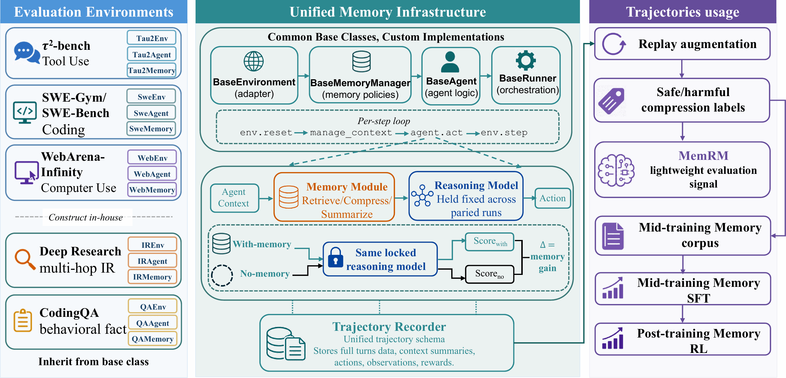
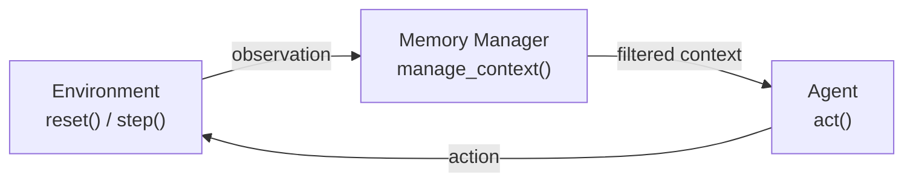
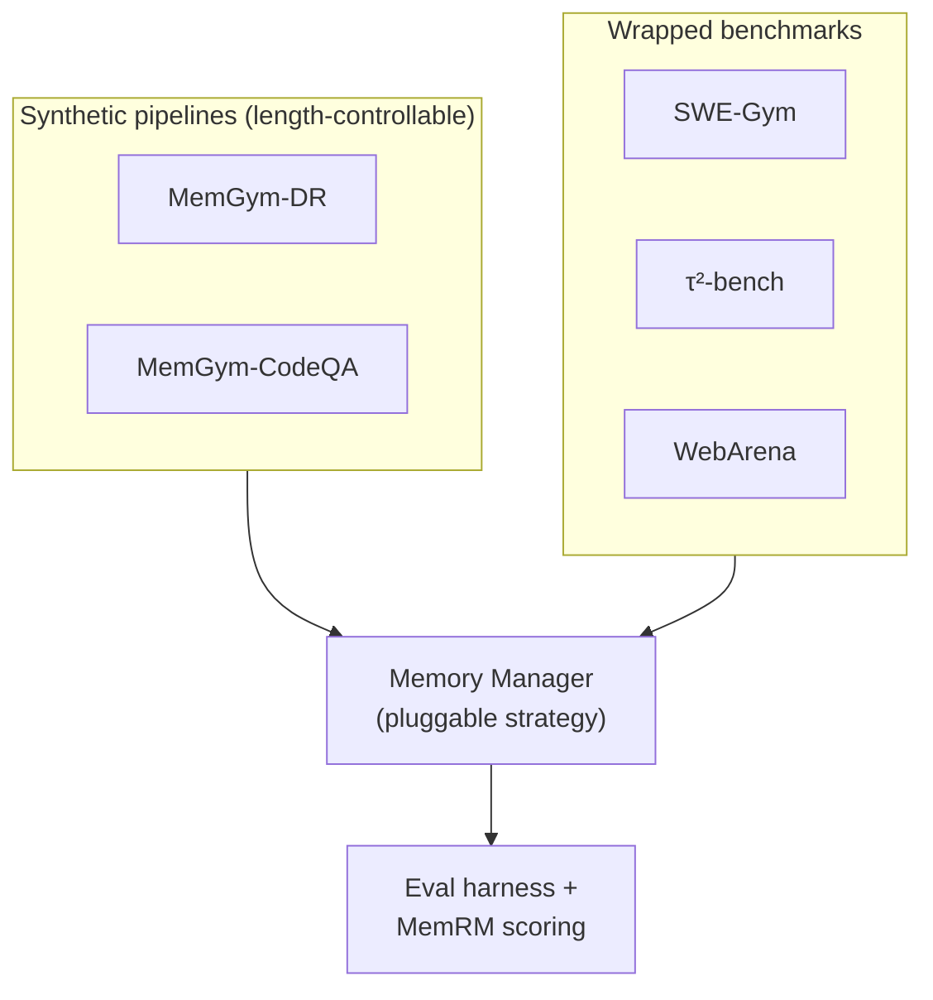

<!-- Drop a hero image at assets/banner.png and uncomment the next line: -->
<!--  -->

# MemGym

[](https://github.com/WujiangXu/MemGym/actions/workflows/ci.yml)
[](https://www.python.org/downloads/)
[](https://arxiv.org/abs/2605.20833)
[](LICENSE)
[](https://github.com/psf/black)
[](https://github.com/astral-sh/ruff)

*A gym for testing — and training — memory in long-context LLM agents.*

As an agent's trajectory grows, its context window fills up and performance
degrades. MemGym makes the *memory* of an agent a first-class, swappable
component: implement one interface, register it by name, and drop it into five
agent tracks behind the same loop — then score it with standardized evals and a
trained Memory Reward Model.

<p align="center">
  
</p>

## Memory–Reasoning Separation

Every track runs the same loop. The environment emits observations; a **memory
manager** decides what context the agent actually sees; the agent reasons over
that filtered context and acts. Swapping the memory strategy never touches the
environment or the agent.



## Tracks

Three tracks **wrap** existing benchmarks; two are **in-house synthetic**
pipelines with length-controllable difficulty.

| Track | Module | Source data |
|-------|--------|-------------|
| SWE-Gym (code repair) | `memgym.gym.swe_bench` | SWE-Gym / SWE-bench Lite |
| τ²-bench (dialogue) | `memgym.gym.tau2_bench` | airline / retail / telecom / mock |
| WebArena (web nav) | `memgym.gym.webarena` | WebArena-Infinity |
| MemGym-DR (multi-hop QA) | `memgym.pipelines.memgym_ir` | `memgym-dr-instances` |
| MemGym-CodeQA (coding QA) | `memgym.pipelines.coding_synthetic` | `memgym-codeqa-instances` |



Per-track run commands: [`docs/tracks.md`](docs/tracks.md). Released datasets and
load snippets: [`docs/data.md`](docs/data.md).

## Installation

```bash
pip install uv                 # one-time; every `pip` below can then be `uv pip`

./install.sh --swe             # SWE-bench only (mini-swe-agent scaffold)
./install.sh --all             # core + SWE-bench requirements (does NOT auto-clone
                               #   tau2-bench / OpenHands — pre-clone them under
                               #   third_party/ first; the script prints the
                               #   exact commands and exits non-zero if missing)
# or, directly:  uv pip install -e ".[swe]"   # extras: swe, tau2, eval, train, dev,
                                              # amem, simplemem, mem0, hipporag,
                                              # memory-eval, webarena, lightmem
```

**Requirements:** Python 3.12+, Docker (for SWE-bench eval), `swebench>=4.1.0`.
See [`docs/quickstart.md`](docs/quickstart.md) for backend setup and first runs,
and [`docs/backends.md`](docs/backends.md) for LLM-provider env wiring.

### Backend × scenario × install

Every scenario accepts the universal baselines (`none`, `passthrough`,
`summary`, `structured`). The column below lists only the **scenario-specific**
memory backends.

| Scenario | Specific backends | Install |
|---|---|---|
| **CodeQA** (`memgym.pipelines.coding_synthetic`) | `amem`, `hipporag`, `simplemem`, `mem0`, `memorybank` | `pip install -e .[memory-eval]` |
| **DeepResearch** (`memgym.pipelines.memgym_ir`) | `ir_bm25`, `ir_naive_rag`, `ir_amem`, `ir_hipporag`, `ir_simplemem`, `ir_mem0`, `ir_memorybank`, `ir_lightmem`¹ | `pip install -e .[memory-eval]` |
| **SWE-Gym** (`gym/swe_bench`) | `swe-amem` | `pip install -e .[swe,amem]` |
| **τ²-bench** (`gym/tau2_bench`) | `tau2_summarizing` | `pip install -e .[tau2]` |
| **WebArena** (`gym/webarena`) | (baselines only) | `pip install -e .[webarena]` |

¹ `ir_lightmem` needs a sidecar venv (upstream pins Python `>=3.10,<3.12`);
see the `[lightmem]` notes in `pyproject.toml`.

`[memory-eval]` pulls A-MEM + SimpleMem + Mem0 (co-installable). `[hipporag]`
is **opt-in separate** — HippoRAG 2.0.0a4 hard-pins
`litellm==1.73.1`/`vllm==0.6.6.post1`, which is **incompatible** with
`[tau2]`/`[openhands]`/`[rl-way-a]` in the same venv. Install HippoRAG in
its own venv if you need both.

## Quickstart

```bash
export OPENAI_API_KEY=sk-...

# Run one memory strategy on the first 10 SWE-bench Lite instances.
memgym-evaluate \
    --model openai/gpt-4o-mini --memory adaptive_token_budget \
    --max-tokens 4000 --slice 0:10 --workers 4 -o results/demo
```

`memgym-evaluate` drives the agent and scores patches with the **official
`swebench` harness** (the same pipeline as sb-cli / the leaderboard). Full flag
reference and the CodeAct/OpenHands path: [`docs/swe_bench.md`](docs/swe_bench.md).

## Memory strategies

Built-in strategies, selected with `--memory <name>`:

| Name | What it does |
|------|--------------|
| `none` / `passthrough` | Baseline — no filtering |
| `llm_summarizing` | Rolling LLM summary (OpenHands default) |
| `observation_masking` | Truncate old observations |
| `naive` | Summarize once over a token limit |
| `adaptive_token_budget` | Pin critical context, keep recent tail, summarize the middle |
| `structured_summary` | LLM function-calling summary |
| `pipeline_masking_summarizing` | Masking + LLM summary |

All LLM-based strategies work with any provider via
[litellm](https://github.com/BerriAI/litellm). Adding your own is one interface +
one `register_memory_model(...)` call — see [`CONTRIBUTING.md`](CONTRIBUTING.md).

## Memory Reward Model (MemRM)

MemRM is a Qwen3-1.7B classifier (QLoRA NF4) that scores whether a proposed
action is *consistent with* a trajectory's recorded memory. Reproduce the paper's
per-dataset table, or score your own memory against the baseline:

```bash
uv pip install -e ".[eval]"

# Reproduce the paper's IID-heldout table (downloads the checkpoint from HF)
memgym-eval-rm --dataset iid-heldout --checkpoint MemGym/memgym-rm-1p7b

# Score a registered memory on a raw-trajectory JSONL
memgym-eval-memory --memory-model my_memory --memory-module my_memory \
    --trajectories sample.jsonl --checkpoint MemGym/memgym-rm-1p7b -o results/mine.json
```

Config, metrics, and reproduction details: [`docs/memrm.md`](docs/memrm.md).
Model card: [`MemGym/memgym-rm-1p7b`](https://huggingface.co/MemGym/memgym-rm-1p7b).

## Data & artifacts

MemGym publishes its corpora and the MemRM checkpoint on the Hugging Face Hub
under [`MemGym/`](https://huggingface.co/MemGym) — schemas, row counts, and load
snippets are in [`docs/data.md`](docs/data.md).

## Documentation

Start at [`docs/`](docs/README.md). Highlights:

- [`docs/quickstart.md`](docs/quickstart.md) — install + first runs for every track
- [`docs/architecture.md`](docs/architecture.md) — Memory–Reasoning Separation design + extension API
- [`docs/tracks.md`](docs/tracks.md) — the five tracks and how to run each
- [`docs/swe_bench.md`](docs/swe_bench.md) — SWE-bench evaluation, CLI args, output format
- [`docs/data.md`](docs/data.md) — data catalog (datasets, schemas, licenses)
- [`docs/memrm.md`](docs/memrm.md) — MemRM config, metrics, reproduction
- [`docs/testing.md`](docs/testing.md) · [`docs/reproducibility.md`](docs/reproducibility.md) — tiered manual tests + smoke transcript

## Citation

If you find MemGym useful in your research, please consider citing:

```bibtex
@misc{xu2026memgym,
  title         = {MemGym: a Long-Horizon Memory Environment for LLM Agents},
  author        = {Xu, Wujiang and Wang, Yu and Mei, Kai and Liang, Kaiqu and Wang, Zhenting and Jin, Mingyu and Zhang, Han and Zhang, Shi-Xiong and Hua, Wenyue and Sahu, Sambit and Metaxas, Dimitris N.},
  year          = {2026},
  eprint        = {2605.20833},
  archivePrefix = {arXiv},
  primaryClass  = {cs.AI}
}
```

## License

Licenses vary by artifact — full matrix in [`docs/licenses.md`](docs/licenses.md):

- **Code** (this repo): Apache-2.0 — see [LICENSE](LICENSE) and [NOTICE](NOTICE).
- **Data & synthetic instances** (MemGym-DR / MemGym-CodeQA, paired-trajectory corpus): MIT.
- **MemRM weights** (`MemGym/memgym-rm-1p7b`): Apache-2.0, inherited from Qwen3-1.7B-Base.
